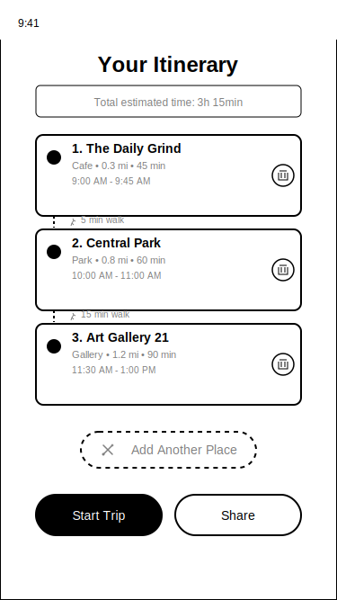

# 🎲 Roulett

> **When you're nearby but nowhere to go** — Let chance decide your next adventure

[](https://opensource.org/licenses/MIT)
[]()

## 🤔 The Problem

You're out in the city. You've got time to kill. There are dozens of places around you, but you're stuck with decision paralysis. "Where should I go?" "What should I do?" Sound familiar?

**Roulett** solves this by taking the decision-making burden off your shoulders. Swipe, spin, and let serendipity guide your day.

---

## 💡 What is Roulett?

Roulett is a location-based discovery app that randomly selects places for you to visit based on your vicinity. No more endless scrolling through reviews or second-guessing your choices. Just pure spontaneity with a touch of intelligence.

Perfect for:
- 🚶 Locals looking to rediscover their city
- ✈️ Travelers who want authentic experiences
- 🎯 Anyone suffering from "too many options" syndrome
- 🎲 Spontaneous souls who trust the universe

---

## ✨ Features

### 🗺️ Interactive Map View
See all nearby places at a glance with an intuitive map interface


### 🎰 Roulette Randomizer
Swipe up to trigger the roulette spinner — watch as it randomly selects your next destination


### 📍 Smart Place Details
Get all the info you need: distance, ratings, estimated visit time, and more


### 📋 Dynamic Itinerary Builder
Build a full day's adventure with multiple randomly discovered spots



### ⚙️ Privacy-First Settings
Control your location sharing and customize your discovery preferences


---

## 🚀 Key Capabilities

- **Smart Randomization**: Never visit the same place twice (unless you want to)
- **No-Go Zones**: Mark places you don't want to see in future spins
- **Visit History**: Track your adventures automatically
- **Location Control**: Use real-time GPS or set a fixed location
- **Itinerary Builder**: Chain multiple places into a full day plan
- **Gesture-Based**: Intuitive swipe gestures for seamless interaction
- **Offline-Ready**: Once loaded, your nearby places work without connectivity

---

## 🎯 How It Works

1. **Share Your Location** (or set a fixed one in settings)
2. **View Nearby Places** on an interactive map
3. **Swipe Up** to trigger the roulette spinner
4. **Discover** your randomly selected destination
5. **Accept** and add to itinerary, or **spin again**
6. **Build** a full day's adventure with multiple places
7. **Go!** Start your spontaneous journey

### The Algorithm

```
1. User swipes → Trigger randomization
2. Fetch places within radius (configurable)
3. Filter out:
   - Already visited places
   - No-go tagged locations
   - Currently closed venues (optional)
4. Weighted random selection based on:
   - Distance (closer = slightly higher weight)
   - Category diversity (avoid clustering)
   - Ratings (minimum threshold)
5. Animate roulette → Present result
6. Store selection in history
```

---

## 🛠️ Tech Stack (Planned)

### Frontend
- **React Native** / **Flutter** — Cross-platform mobile development
- **MapKit** / **Google Maps SDK** — Interactive map rendering
- **Reanimated** — Smooth gesture animations

### Backend
- **Node.js** + **Express** / **Firebase** — API and authentication
- **PostgreSQL** / **MongoDB** — User data and preferences
- **Redis** — Session management and caching

### APIs & Services
- **Google Places API** / **Foursquare API** — Place data
- **Geolocation API** — User positioning
- **OpenStreetMap** (alternative) — Free mapping data

---

## 📱 User Flow

```
┌─────────────────┐
│   Open App      │
└────────┬────────┘
         │
         ▼
┌─────────────────┐      ┌──────────────────┐
│ Location Prompt │─────▶│  Grant Access    │
└────────┬────────┘      └────────┬─────────┘
         │                        │
         ▼                        │
┌─────────────────┐              │
│   Map View      │◀─────────────┘
│  (12 places)    │
└────────┬────────┘
         │
         ▼ (Swipe Up)
┌─────────────────┐
│ Roulette Spin   │
└────────┬────────┘
         │
         ▼
┌─────────────────┐
│ Place Details   │
└────────┬────────┘
         │
    ┌────┴────┐
    ▼         ▼
┌────────┐  ┌──────────┐
│Add to  │  │Spin Again│
│Trip    │  │          │
└───┬────┘  └─────┬────┘
    │             │
    ▼             └─────────────┐
┌─────────────────┐             │
│   Itinerary     │             │
│   Builder       │◀────────────┘
└────────┬────────┘
         │
         ▼
┌─────────────────┐
│  Start Trip     │
└─────────────────┘
```

---

## 🔒 Privacy & Data

- **Location Data**: Stored locally, only sent to server for place queries
- **Visit History**: Encrypted and stored per device
- **No-Go List**: Private, never shared
- **Analytics**: Opt-in only, anonymous aggregated data
- **Data Deletion**: One-tap complete data wipe in settings

---

## 🎨 Design Philosophy

- **Minimal Friction**: Get to discovery in < 2 taps
- **Gestural**: Natural swipe interactions
- **Visual First**: Images and maps before text
- **Trust the Randomness**: Embrace uncertainty as a feature
- **Personality**: Playful without being childish

---

## 🗓️ Roadmap

### Phase 1: MVP (Current)
- [x] Core UI mockups
- [ ] Map integration
- [ ] Basic randomization algorithm
- [ ] Location services
- [ ] Single place discovery

### Phase 2: Enhanced Discovery
- [ ] Multi-place itinerary builder
- [ ] Visit history tracking
- [ ] No-go list functionality
- [ ] Place categories filter
- [ ] Adjustable search radius

### Phase 3: Social & Smart
- [ ] Share itineraries with friends
- [ ] Group discovery (multiple users, one spin)
- [ ] ML-based preferences (learn what you like)
- [ ] Weather-aware suggestions
- [ ] Time-of-day recommendations

### Phase 4: Gamification
- [ ] Achievement badges
- [ ] Discovery streaks
- [ ] Local explorer leaderboards
- [ ] Community challenges

---

## 🤝 Contributing

This project is in early development. Contributions, ideas, and feedback are welcome!

### Setup (Coming Soon)
```bash
# Clone the repository
git clone https://github.com/yourusername/roulett.git

# Install dependencies
npm install

# Run development server
npm run dev
```

---

## 📄 License

MIT License - feel free to use this concept for your own projects!

---

## 🎲 Why "Roulett"?

Because like a roulette wheel, every spin is a gamble. You might discover your new favorite spot, or you might end up somewhere totally unexpected. That's the beauty of it. Plus, `.com` was available 😉

---

## 💬 Contact & Feedback

Have ideas? Found a bug? Want to collaborate?

- 📧 Email: hello@roulett.app (coming soon)
- 🐦 Twitter: @roulettapp (coming soon)
- 💬 Discord: [Join our community](https://discord.gg/roulett) (coming soon)

---

**Remember**: The best adventures are the ones you don't plan. Let Roulett be your guide. 🎯


