# iOS Development Guidelines - xplorr

This document provides iOS-specific development guidelines, design principles, and implementation workflows for building xplorr using Swift and SwiftUI.

> **Related Documentation:**
> - **[← Back to Main Technical Overview](./technical_implementation.md)**
> - **[Backend API Guide](./technical_implementation_backend.md)** - For API integration details

---

## 🎨 Design Philosophy - Liquid Glass & iOS Principles

### Apple's Liquid Glass Design System

Following Apple's [Liquid Glass design language](https://developer.apple.com/documentation/TechnologyOverviews/liquid-glass), xplorr embraces:

**Visual Hierarchy & Depth**
- Use of translucent materials and blur effects
- Layered UI with clear depth perception
- Dynamic shadows and elevation
- Glass-like surfaces that allow content to show through

**Fluidity & Motion**
- Smooth, physics-based animations
- Natural transitions between states
- Gesture-driven interactions
- Continuous feedback during user actions

**Spatial Design**
- Full-screen immersive experiences
- Floating UI elements over map content
- Dynamic spacing and padding
- Context-aware component positioning

**Material Authenticity**
- `.ultraThinMaterial` for floating cards
- `.regularMaterial` for persistent UI
- Vibrancy effects for text over blurred backgrounds
- Shadow and glow effects for elevation

---

## 📋 iOS Development Workflow

### Phase 1: Project Setup (Week 1)

**1.1 Create Xcode Project**
```bash
# Create new iOS App project
# - Product Name: xplorr
# - Interface: SwiftUI
# - Language: Swift
# - Minimum iOS: 17.0
```

**1.2 Project Structure**
```
xplorr/
├── App/
│   ├── xplorrApp.swift
│   └── AppDelegate.swift
├── Views/
│   ├── ContentView.swift
│   ├── Map/
│   ├── Roulette/
│   ├── PlaceDetail/
│   └── Itinerary/
├── ViewModels/
├── Models/
├── Services/
├── Components/
└── Resources/
    ├── Assets.xcassets
    └── Colors.swift
```

**1.3 Dependencies Setup**
Using Swift Package Manager, add:
- No external dependencies for MVP (use native frameworks)
- Consider adding for future: Alamofire (networking helper), SwiftyJSON (if needed)

**1.4 Configuration Files**
```swift
// Config.swift
enum Config {
    enum API {
        static let baseURL = "http://localhost:8080"
        static let timeout: TimeInterval = 30
    }
    
    enum Map {
        static let defaultRadius: Double = 5.0 // miles
        static let animationDuration: Double = 0.3
    }
}
```

---

### Phase 2: Core Components (Week 2-3)

#### 2.1 Color System

```swift
// Resources/Colors.swift
import SwiftUI

extension Color {
    // Primary Brand Colors
    static let xplorrPrimary = Color("Primary")
    static let xplorrSecondary = Color("Secondary")
    
    // UI Colors
    static let floatingCard = Color.white.opacity(0.95)
    static let glassMaterial = Color.white.opacity(0.85)
    
    // Semantic Colors
    static let visited = Color.green.opacity(0.8)
    static let noGo = Color.red.opacity(0.8)
    static let available = Color.blue.opacity(0.8)
}
```

#### 2.2 Reusable Components

**Floating Pill Button (Liquid Glass):**
```swift
// Components/UI/PillButton.swift
struct PillButton: View {
    let title: String
    let icon: String?
    let action: () -> Void
    
    var body: some View {
        Button(action: action) {
            HStack(spacing: 12) {
                if let icon = icon {
                    Image(systemName: icon)
                }
                Text(title)
                    .fontWeight(.semibold)
            }
            .foregroundStyle(.primary.opacity(0.85)) // Vibrancy
            .padding(.horizontal, 20)
            .padding(.vertical, 12)
            .background(.ultraThinMaterial) // Blur + translucency
            .background(Color.white.opacity(0.1)) // Subtle tint
            .clipShape(Capsule())
            .overlay(
                Capsule()
                    .stroke(Color.white.opacity(0.6), lineWidth: 1.5) // Glass edge
            )
            .shadow(color: .black.opacity(0.15), radius: 10, y: 5)
        }
        .buttonStyle(.plain)
    }
}
```

**Floating Card (Liquid Glass):**
```swift
// Components/UI/FloatingCard.swift
struct FloatingCard<Content: View>: View {
    let content: Content
    
    init(@ViewBuilder content: () -> Content) {
        self.content = content()
    }
    
    var body: some View {
        content
            .padding()
            .background(.ultraThinMaterial) // Blur + translucency
            .background(Color.white.opacity(0.1)) // Subtle white tint
            .clipShape(RoundedRectangle(cornerRadius: 20))
            .overlay(
                RoundedRectangle(cornerRadius: 20)
                    .stroke(Color.white.opacity(0.6), lineWidth: 1.5) // Glass edge highlight
            )
            .shadow(color: .black.opacity(0.15), radius: 15, y: 8)
    }
}
```

**X Logo View:**
```swift
// Components/XLogoView.swift
struct XLogoView: View {
    @State private var isRotating = false
    let size: CGFloat
    let isAnimating: Bool
    
    var body: some View {
        ZStack {
            // Main diagonal with circle at origin
            Path { path in
                path.move(to: CGPoint(x: size * 0.2, y: size * 0.8))
                path.addLine(to: CGPoint(x: size * 0.8, y: size * 0.2))
            }
            .stroke(Color.primary, lineWidth: 3)
            
            // Circle at origin (SW)
            Circle()
                .fill(Color.primary)
                .frame(width: 8, height: 8)
                .offset(x: -size * 0.3, y: size * 0.3)
            
            // Small X at destination (NE)
            XMarkView(size: size * 0.15)
                .offset(x: size * 0.3, y: -size * 0.3)
            
            // Other diagonal
            Path { path in
                path.move(to: CGPoint(x: size * 0.2, y: size * 0.2))
                path.addLine(to: CGPoint(x: size * 0.8, y: size * 0.8))
            }
            .stroke(Color.primary, lineWidth: 3)
        }
        .frame(width: size, height: size)
        .rotationEffect(.degrees(isRotating ? 360 : 0))
        .animation(
            isAnimating ? .linear(duration: 2).repeatForever(autoreverses: false) : .default,
            value: isRotating
        )
        .onAppear {
            if isAnimating {
                isRotating = true
            }
        }
    }
}

struct XMarkView: View {
    let size: CGFloat
    
    var body: some View {
        ZStack {
            Rectangle()
                .fill(Color.primary)
                .frame(width: size, height: 2)
            Rectangle()
                .fill(Color.primary)
                .frame(width: 2, height: size)
        }
        .rotationEffect(.degrees(45))
    }
}
```

---

### Phase 3: Map Implementation (Week 3-4)

#### 3.1 Location Manager

```swift
// Services/LocationManager.swift
import CoreLocation
import Combine

class LocationManager: NSObject, ObservableObject {
    private let locationManager = CLLocationManager()
    
    @Published var location: CLLocation?
    @Published var authorizationStatus: CLAuthorizationStatus = .notDetermined
    
    override init() {
        super.init()
        locationManager.delegate = self
        locationManager.desiredAccuracy = kCLLocationAccuracyBest
    }
    
    func requestPermission() {
        locationManager.requestWhenInUseAuthorization()
    }
    
    func startUpdating() {
        locationManager.startUpdatingLocation()
    }
    
    func stopUpdating() {
        locationManager.stopUpdatingLocation()
    }
}

extension LocationManager: CLLocationManagerDelegate {
    func locationManager(_ manager: CLLocationManager, didUpdateLocations locations: [CLLocation]) {
        location = locations.last
    }
    
    func locationManagerDidChangeAuthorization(_ manager: CLLocationManager) {
        authorizationStatus = manager.authorizationStatus
    }
}
```

#### 3.2 Map View with MapKit

```swift
// Views/Map/MapView.swift
import SwiftUI
import MapKit

struct MapView: View {
    @StateObject private var viewModel = MapViewModel()
    @StateObject private var locationManager = LocationManager()
    @State private var isShowingRoulette = false
    
    var body: some View {
        ZStack {
            // Full-screen map
            Map(coordinateRegion: $viewModel.region, 
                showsUserLocation: true,
                annotationItems: viewModel.places) { place in
                MapAnnotation(coordinate: place.coordinate) {
                    PlaceMarker(place: place)
                }
            }
            .ignoresSafeArea()
            
            // Floating header
            VStack {
                headerCard
                Spacer()
                statsCard
            }
            .padding()
            
            // Center X logo button
            centerButton
        }
        .onAppear {
            locationManager.requestPermission()
            locationManager.startUpdating()
        }
        .onChange(of: locationManager.location) { newLocation in
            if let location = newLocation {
                viewModel.updateUserLocation(location)
            }
        }
        .sheet(isPresented: $isShowingRoulette) {
            RouletteView(viewModel: viewModel)
        }
    }
    
    private var headerCard: some View {
        FloatingCard {
            HStack {
                Button(action: { /* Menu */ }) {
                    Image(systemName: "line.3.horizontal")
                }
                
                Spacer()
                
                Text("xplorr")
                    .font(.title2)
                    .fontWeight(.bold)
                
                Spacer()
                
                ZStack(alignment: .topTrailing) {
                    Button(action: { /* Itinerary */ }) {
                        Image(systemName: "map.circle")
                    }
                    
                    if viewModel.itineraryCount > 0 {
                        Circle()
                            .fill(Color.black)
                            .frame(width: 18, height: 18)
                            .overlay(
                                Text("\(viewModel.itineraryCount)")
                                    .font(.caption2)
                                    .foregroundColor(.white)
                            )
                            .offset(x: 8, y: -8)
                    }
                }
            }
            .font(.title3)
        }
    }
    
    private var centerButton: some View {
        Button(action: {
            isShowingRoulette = true
            viewModel.startRandomization()
        }) {
            VStack(spacing: 8) {
                XLogoView(size: 60, isAnimating: false)
                    .frame(width: 70, height: 70)
                    .background(
                        Circle()
                            .fill(.ultraThinMaterial)
                            .shadow(color: .black.opacity(0.2), radius: 15)
                    )
                
                Text("TAP TO EXPLORE")
                    .font(.caption)
                    .fontWeight(.bold)
            }
        }
        .buttonStyle(.plain)
    }
    
    private var statsCard: some View {
        FloatingCard {
            HStack {
                VStack(alignment: .leading, spacing: 4) {
                    Text("\(viewModel.nearbyPlacesCount) places nearby")
                        .font(.subheadline)
                        .fontWeight(.semibold)
                    
                    Text("✓ \(viewModel.visitedCount) visited • ✗ \(viewModel.noGoCount) no-go")
                        .font(.caption)
                        .foregroundColor(.secondary)
                }
                Spacer()
            }
        }
    }
}
```

---

## 📱 iOS Design Reference - Liquid Glass Implementation

### Randomizer Screen Example

Below is a realistic mockup showing how the randomizer screen implements Apple's Liquid Glass design principles with MapKit integration:



**Key Design Elements:**

**1. Translucent Materials (Liquid Glass)**
- **Top Header Card**: True glass effect with ~25% white opacity + blur filter + subtle border
- **Bottom Action Pill**: Matching translucent treatment - you can see the map through it
- **Center Button**: Circular glass with same transparency, allowing background visibility
- **Key Principle**: Background should be clearly visible through all glass surfaces

**2. Apple Maps Integration**
- Full-screen MapKit view as base layer
- Street lines and landmarks rendered in Apple Maps style
- Multiple available place markers (green circles with white centers)
- Blue selection indicator randomly jumping between locations

**3. Visual Hierarchy**
```swift
// SwiftUI Material Implementation (Liquid Glass)
.background(.ultraThinMaterial) // This provides the blur and translucency
.background(Color.white.opacity(0.1)) // Subtle tint
.overlay(
    RoundedRectangle(cornerRadius: 28)
        .stroke(Color.white.opacity(0.6), lineWidth: 1.5) // Glass edge
)
.shadow(color: .black.opacity(0.15), radius: 15, y: 8)

// Important: Background must be visible through the material!
```

**4. Animation Details**
- **Spinning Circle Icon** (top left): Continuous rotation at 1.5s duration
- **X Logo Center**: 2-second rotation with spring physics
- **Blue Jump Selector**: Randomly appears at different place markers with concentric pulse rings
- **Ghost Trails**: Previous selection positions fade out (40% → 25% → 0% opacity)
- **Jump Path Lines**: Subtle dashed lines connecting jump sequence

**5. iOS System Elements**
- **Status Bar**: Shows time (9:41), cellular, WiFi, battery
- **Dynamic Island**: Black pill shape for iPhone 14 Pro+ models
- **Home Indicator**: Bottom gesture bar (130pt wide, centered)

**Implementation Notes:**

```swift
// Header with true liquid glass effect
HStack(spacing: 12) {
    ProgressView()
        .progressViewStyle(.circular)
        .tint(.blue)
    
    Text(selectedPlace.name)
        .font(.headline)
        .fontWeight(.semibold)
        .foregroundStyle(.primary.opacity(0.85)) // Vibrancy effect
}
.padding(.horizontal, 24)
.padding(.vertical, 14)
.frame(maxWidth: 280)
.background(.ultraThinMaterial) // Blur + translucency - background is visible!
.background(Color.white.opacity(0.1)) // Subtle tint
.clipShape(Capsule())
.overlay(
    Capsule()
        .stroke(Color.white.opacity(0.6), lineWidth: 1.5) // Glass edge highlight
)
.shadow(color: .black.opacity(0.15), radius: 15, y: 8)
```

**Jumping Selector Animation:**

```swift
// Random jumping between place markers
struct JumpingSelectorView: View {
    let places: [Place]
    @State private var currentIndex: Int = 0
    @State private var previousIndices: [Int] = []
    
    var body: some View {
        ZStack {
            // Ghost trails of previous positions
            ForEach(Array(previousIndices.enumerated()), id: \.offset) { index, placeIndex in
                let opacity = Double(previousIndices.count - index) / Double(previousIndices.count)
                PulseRing(opacity: opacity * 0.4)
                    .position(places[placeIndex].coordinate.toCGPoint())
            }
            
            // Current selection with strong pulse
            PulseRing(opacity: 1.0)
                .position(places[currentIndex].coordinate.toCGPoint())
        }
        .onAppear {
            startRandomJumping()
        }
    }
    
    private func startRandomJumping() {
        Timer.scheduledTimer(withTimeInterval: 0.4, repeats: true) { _ in
            withAnimation(.spring(response: 0.3, dampingFraction: 0.7)) {
                previousIndices.append(currentIndex)
                if previousIndices.count > 3 {
                    previousIndices.removeFirst()
                }
                currentIndex = Int.random(in: 0..<places.count)
            }
        }
    }
}

struct PulseRing: View {
    let opacity: Double
    @State private var pulseScale: CGFloat = 1.0
    
    var body: some View {
        ZStack {
            // Outer rings
            Circle()
                .fill(Color.blue.opacity(opacity * 0.15))
                .frame(width: 64, height: 64)
                .scaleEffect(pulseScale)
            
            Circle()
                .fill(Color.blue.opacity(opacity * 0.25))
                .frame(width: 48, height: 48)
                .scaleEffect(pulseScale * 0.8)
            
            // Core
            Circle()
                .fill(Color.blue.opacity(opacity))
                .frame(width: 24, height: 24)
        }
        .onAppear {
            withAnimation(.easeInOut(duration: 0.8).repeatForever(autoreverses: true)) {
                pulseScale = 1.2
            }
        }
    }
}
```

**Color Palette:**
- Primary Action: `#007AFF` (iOS Blue)
- Success/Available: `#34C759` (iOS Green)
- Glass Material: `.ultraThinMaterial` with `rgba(255, 255, 255, 0.25)` tint (highly translucent!)
- Glass Border: `rgba(255, 255, 255, 0.6)` for edge definition
- Map Background: `#e8f4f8` to `#c2dfe8` gradient
- Text on Glass: Black at 70-85% opacity for proper vibrancy effect

This design ensures the app feels native to iOS while maintaining the xplorr brand identity through the custom X logo and interaction patterns.

---

### Phase 4: Animations & Transitions (Week 4-5)

#### 4.1 Route Pulse Animation

```swift
// Views/Roulette/RouteAnimationView.swift
struct RouteAnimationView: View {
    let origin: CLLocationCoordinate2D
    let destination: CLLocationCoordinate2D
    @State private var pulseProgress: CGFloat = 0
    
    var body: some View {
        Canvas { context, size in
            // Draw route line
            var path = Path()
            path.move(to: coordinateToPoint(origin, in: size))
            path.addLine(to: coordinateToPoint(destination, in: size))
            
            context.stroke(
                path,
                with: .color(.primary),
                style: StrokeStyle(lineWidth: 4, dash: [12, 8])
            )
            
            // Draw pulse circles along path
            drawPulses(context: &context, size: size)
        }
        .onAppear {
            withAnimation(.linear(duration: 1.5).repeatForever(autoreverses: false)) {
                pulseProgress = 1.0
            }
        }
    }
    
    private func drawPulses(context: inout GraphicsContext, size: CGSize) {
        let positions = [0.3, 0.6, 0.9]
        for position in positions {
            let point = interpolatePoint(progress: position)
            let radius = 8 + (pulseProgress * 12)
            let opacity = 1.0 - pulseProgress
            
            context.opacity = opacity
            context.stroke(
                Circle().path(in: CGRect(x: point.x - radius, y: point.y - radius,
                                        width: radius * 2, height: radius * 2)),
                with: .color(.primary),
                lineWidth: 2
            )
        }
    }
    
    private func interpolatePoint(progress: Double) -> CGPoint {
        // Linear interpolation between origin and destination
        let x = origin.latitude + (destination.latitude - origin.latitude) * progress
        let y = origin.longitude + (destination.longitude - origin.longitude) * progress
        return coordinateToPoint(CLLocationCoordinate2D(latitude: x, longitude: y), in: .zero)
    }
    
    private func coordinateToPoint(_ coordinate: CLLocationCoordinate2D, in size: CGSize) -> CGPoint {
        // Convert coordinate to screen point
        // This is simplified - in real implementation, use proper map projection
        return CGPoint(x: size.width / 2, y: size.height / 2)
    }
}
```

#### 4.2 Spring Animations

```swift
// Utilities/Animations.swift
extension Animation {
    static let xplorrSpring = Animation.spring(response: 0.4, dampingFraction: 0.7)
    static let xplorrEaseOut = Animation.easeOut(duration: 0.3)
    static let xplorrBounce = Animation.spring(response: 0.5, dampingFraction: 0.5)
}
```

---

### Phase 5: Networking Layer (Week 5)

#### 5.1 API Client

```swift
// Services/APIClient.swift
import Foundation
import Combine

class APIClient {
    static let shared = APIClient()
    private let baseURL = Config.API.baseURL
    private let session = URLSession.shared
    
    func request<T: Decodable>(
        endpoint: String,
        method: HTTPMethod = .get,
        parameters: [String: Any]? = nil
    ) async throws -> T {
        guard let url = URL(string: "\(baseURL)\(endpoint)") else {
            throw APIError.invalidURL
        }
        
        var request = URLRequest(url: url)
        request.httpMethod = method.rawValue
        request.addValue("application/json", forHTTPHeaderField: "Content-Type")
        
        if let parameters = parameters {
            request.httpBody = try JSONSerialization.data(withJSONObject: parameters)
        }
        
        let (data, response) = try await session.data(for: request)
        
        guard let httpResponse = response as? HTTPURLResponse,
              (200...299).contains(httpResponse.statusCode) else {
            throw APIError.serverError
        }
        
        return try JSONDecoder().decode(T.self, from: data)
    }
}

enum HTTPMethod: String {
    case get = "GET"
    case post = "POST"
    case put = "PUT"
    case delete = "DELETE"
}

enum APIError: Error {
    case invalidURL
    case serverError
    case decodingError
}
```

#### 5.2 Places Service

```swift
// Services/PlacesService.swift
class PlacesService {
    private let apiClient = APIClient.shared
    
    func fetchNearbyPlaces(
        latitude: Double,
        longitude: Double,
        radius: Double
    ) async throws -> [Place] {
        return try await apiClient.request(
            endpoint: "/api/places/nearby?latitude=\(latitude)&longitude=\(longitude)&radius=\(radius)"
        )
    }
    
    func getPlaceDetails(id: String) async throws -> Place {
        return try await apiClient.request(endpoint: "/api/places/\(id)")
    }
    
    func randomizePlace(excludeIds: [String]) async throws -> Place {
        return try await apiClient.request(
            endpoint: "/api/places/random",
            method: .post,
            parameters: ["excludeIds": excludeIds]
        )
    }
}
```

---

### Phase 6: Data Persistence (Week 6)

#### 6.1 UserDefaults Manager

```swift
// Storage/UserDefaultsManager.swift
class UserDefaultsManager {
    static let shared = UserDefaultsManager()
    private let defaults = UserDefaults.standard
    
    private enum Keys {
        static let visitHistory = "visitHistory"
        static let noGoList = "noGoList"
        static let searchRadius = "searchRadius"
        static let preferences = "preferences"
    }
    
    var visitHistory: [String] {
        get { defaults.stringArray(forKey: Keys.visitHistory) ?? [] }
        set { defaults.set(newValue, forKey: Keys.visitHistory) }
    }
    
    var noGoList: [String] {
        get { defaults.stringArray(forKey: Keys.noGoList) ?? [] }
        set { defaults.set(newValue, forKey: Keys.noGoList) }
    }
    
    var searchRadius: Double {
        get { defaults.double(forKey: Keys.searchRadius) != 0 ? defaults.double(forKey: Keys.searchRadius) : 5.0 }
        set { defaults.set(newValue, forKey: Keys.searchRadius) }
    }
    
    func addToVisitHistory(_ placeId: String) {
        var history = visitHistory
        if !history.contains(placeId) {
            history.append(placeId)
            visitHistory = history
        }
    }
    
    func addToNoGoList(_ placeId: String) {
        var list = noGoList
        if !list.contains(placeId) {
            list.append(placeId)
            noGoList = list
        }
    }
}
```

---

## 🎯 Implementation Priorities

### Sprint 1 (Week 1-2): Foundation
- [x] Project setup and structure
- [ ] Color system and design tokens
- [ ] Reusable UI components
- [ ] X logo component with animation
- [ ] Basic navigation structure

### Sprint 2 (Week 3-4): Core Features
- [ ] MapKit integration
- [ ] Location services
- [ ] Place markers on map
- [ ] Floating UI elements
- [ ] Center button interaction

### Sprint 3 (Week 5-6): Randomization
- [ ] Route animation view
- [ ] Randomizer logic
- [ ] API integration
- [ ] Place details view
- [ ] Add to itinerary

### Sprint 4 (Week 7-8): Polish & Persistence
- [ ] Data persistence
- [ ] Settings screen
- [ ] Itinerary management
- [ ] Visit history tracking
- [ ] Performance optimization

---

## 📱 Testing Strategy

### Unit Tests
```swift
// Tests for ViewModels
func testRandomizerExcludesVisitedPlaces() {
    let viewModel = MapViewModel()
    viewModel.visitedPlaces = ["place1", "place2"]
    // Test randomization logic
}
```

### UI Tests
```swift
// Test user flows
func testTapToExploreFlow() {
    let app = XCUIApplication()
    app.launch()
    app.buttons["TAP TO EXPLORE"].tap()
    XCTAssert(app.staticTexts["Finding your spot..."].exists)
}
```

### Performance Tests
- Monitor map rendering performance
- Test animation frame rates (target: 60fps)
- Measure API response times
- Test memory usage with multiple places

---

## 🎨 Design Guidelines

### Typography
```swift
extension Font {
    static let xplorrTitle = Font.system(size: 28, weight: .bold, design: .rounded)
    static let xplorrHeadline = Font.system(size: 20, weight: .semibold)
    static let xplorrBody = Font.system(size: 16, weight: .regular)
    static let xplorrCaption = Font.system(size: 12, weight: .medium)
}
```

### Spacing System
```swift
enum Spacing {
    static let xs: CGFloat = 4
    static let sm: CGFloat = 8
    static let md: CGFloat = 16
    static let lg: CGFloat = 24
    static let xl: CGFloat = 32
}
```

### Animation Guidelines
- Use spring animations for interactive elements
- Duration: 0.3-0.5s for most transitions
- Ease-out for appearing content
- Ease-in for disappearing content
- Use `.ultraThinMaterial` for glass effect

---

## 🔧 Development Tools

### Xcode Shortcuts
- `Cmd+R`: Build and run
- `Cmd+B`: Build
- `Cmd+U`: Run tests
- `Cmd+Shift+K`: Clean build folder
- `Cmd+.`: Stop running

### SwiftUI Preview
```swift
#Preview {
    MapView()
        .preferredColorScheme(.light)
}

#Preview("Dark Mode") {
    MapView()
        .preferredColorScheme(.dark)
}
```

### Debugging
- Use `print()` statements sparingly
- Leverage breakpoints in Xcode
- Use Instruments for performance profiling
- Monitor memory graph for leaks

---

## 📚 Resources

### Internal Documentation
- **[Main Technical Overview](./technical_implementation.md)** - High-level architecture
- **[Backend API Guide](./technical_implementation_backend.md)** - API endpoints and integration
- [Main README](../README.md) - Project overview

### Apple Developer Resources
- [Apple Human Interface Guidelines](https://developer.apple.com/design/human-interface-guidelines/)
- [Apple Liquid Glass Design](https://developer.apple.com/documentation/TechnologyOverviews/liquid-glass)
- [SwiftUI Documentation](https://developer.apple.com/documentation/swiftui/)
- [MapKit Documentation](https://developer.apple.com/documentation/mapkit/)
- [Swift Style Guide](https://google.github.io/swift/)

---

**Last Updated:** October 18, 2025

